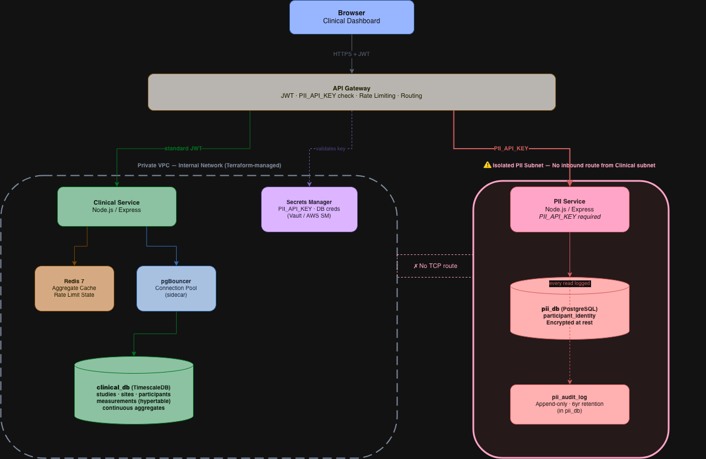

# Clinical Data Platform: Database Schema & Architecture Design Proposal

**Author:** Ian Rios
**Date:** 2026-06-11
**Status:** Proposed
**Scope:** Schema redesign, infrastructure evolution, and PII isolation strategy for projected 50–100M row scale

---

## 1. Executive Summary

The current application is built on a single denormalized table (`clinical_data_raw`) with ~500K rows. This worked for initial development, but a principal-engineer code review and scale projection analysis reveal that the architecture will fail under planned growth: 20+ studies, 5K–10K participants each, 50+ measurement types, and 50–100M rows within two years.

This proposal covers four interlocking changes:

1. **Normalize the schema** — split `clinical_data_raw` into proper dimension tables (`studies`, `sites`, `participants`) and a fact table (`measurements`). Fix all column types and add `NOT NULL` constraints.
2. **Adopt TimescaleDB** — convert `measurements` to a time-partitioned hypertable. Add continuous aggregates that pre-compute the three expensive dashboard queries so they become sub-millisecond reads.
3. **Isolate PII into a separate microservice** — `participant_dob`, raw demographics, and any identifying participant data move to a dedicated `pii_db` behind a separate service requiring a `PII_API_KEY`. The clinical service has no network route to PII data.
4. **Add a caching and connection layer** — Redis caches aggregated dashboard results; pgBouncer pools connections; an API Gateway handles routing, JWT validation, and PII key enforcement.

The combined result: dashboard query time drops from an estimated **10–30 seconds at 100M rows** (with the current schema) to **< 10ms** via continuous aggregates and Redis.

---

## 2. Current State & Root Cause Analysis

This section summarizes findings from the post-Task-2 code review. These are root causes, not symptoms — patches to the existing schema do not fix them.

### 2.1 Schema Defects

**Everything denormalized onto every row.** `study_name`, `study_phase`, `study_start_date`, `participant_dob`, `participant_gender`, `participant_enrollment_date`, `site_name`, `site_location`, and `site_coordinator` are repeated on every measurement row. A participant with 100 measurements has their date of birth stored 100 times. At 100M rows, this is ~10x the storage and query surface needed.

**`measurement_value` is `TEXT` and cannot be naively changed to `NUMERIC`.** The column stores scalar values for most measurement types, but blood pressure is seeded as a composite string (`"120/80"`) — systolic and diastolic packed into one field. This prevents a direct `ALTER COLUMN ... TYPE NUMERIC` migration and requires a deliberate data model decision (see §4.4).

**No FK constraints — referential integrity is not enforced.** While `study_id`, `participant_id`, `measurement_type`, and `measurement_value` all carry `NOT NULL`, there are no foreign key relationships within the denormalized table. A study ID that appears in measurements has no authoritative `studies` record to validate against. Invalid references can be inserted silently.

**`participant_dob` is stored in the measurements table with no access controls.** Every measurement row carries the participant's full date of birth, queryable by anyone with SELECT access. There are no audit logs for reads, no masking, and no access boundary between clinical measurements and personal identifiers. The seeder also generates participant names and other demographics — a clear indicator that PII was always expected to be part of the data model, and the access control architecture needs to reflect that.

### 2.2 API Symptoms (caused by the flat schema)

| Symptom | Root Cause |
|---|---|
| `/studies/overview` rescans all 500K rows just to get study metadata | No `studies` dimension table |
| `study_info` CTE does a second full-table `SELECT DISTINCT` | Same — no `studies` table to join against |
| `transform.ts` parses aggregate fields from `string` using `parseInt`/`parseFloat` | The `node-postgres` driver returns `COUNT(*)`, `AVG()`, and `SUM()` results as strings regardless of the underlying column type — this is a driver-level behavior, not a column type defect. The normalized schema does not eliminate this, but it reduces the number of places the transform layer must compensate. |
| `/studies/list` and `/studies/overview` both scan the raw table | Study dimension data not stored separately |

### 2.3 Scale Projections

| Metric | Today | 2 Years |
|---|---|---|
| Studies | 5 | 25+ |
| Participants per study | ~200 | 5,000–10,000 |
| Measurement types | 6 | 50+ |
| Total rows | ~500K | 50–100M |
| Estimated `/quality/distribution` query time | ~80ms | 20–60 seconds (full scan) |
| Estimated `/participants/summary` query time | ~200ms | timeout |

Without architectural change, the dashboard becomes unusable before the 2-year projection is reached.

---

## 3. Proposed Architecture

### 3.1 System Topology

**Service architecture** — a public API Gateway is the single ingress point. It routes to two internal services: the Clinical Service (standard JWT) and the PII Service (PII_API_KEY required). The Clinical Service reads from `clinical_db` via pgBouncer and uses Redis for caching. The PII Service connects exclusively to `pii_db` in an isolated network segment with no TCP route from the Clinical subnet.


**Deployment topology** — shows VPC layout, subnet isolation, Terraform-enforced security group rules, and the no-ingress boundary between the clinical and PII subnets.



### 3.2 Service Responsibilities

| Service | Owns | Technology |
|---|---|---|
| **API Gateway** | Auth, routing, rate limiting, PII key enforcement | NGINX / Kong / Express middleware |
| **Clinical Service** | Measurements, quality, study/site analytics | Node.js + Express (existing) |
| **PII Service** | Participant identity, consent, demographics | Separate Node.js service |
| **Audit Service** | Immutable log of all PII reads | Append-only Postgres table in pii_db |
| **clinical_db** | Normalized measurements + dimension tables | PostgreSQL 16 + TimescaleDB extension |
| **pii_db** | PII records + audit log | PostgreSQL 16, encrypted at rest, isolated network |
| **Redis** | Dashboard aggregate cache, rate limit counters | Redis 7 |
| **pgBouncer** | Connection pooling for clinical_db | pgBouncer 1.21 |

---

## 4. Schema Design

### 4.1 Clinical Database (`clinical_db`)

#### `studies`
```sql
CREATE TABLE studies (
    study_id          TEXT         PRIMARY KEY,
    study_name        TEXT         NOT NULL,
    study_phase       TEXT         NOT NULL,
    study_start_date  DATE,
    created_at        TIMESTAMPTZ  DEFAULT NOW()
);
```
5–25 rows. Tiny. Any study metadata query becomes a PK lookup instead of a full scan of measurements.

---

#### `sites`
```sql
CREATE TABLE sites (
    site_id          TEXT         PRIMARY KEY,
    site_name        TEXT         NOT NULL,
    site_location    TEXT,
    site_coordinator TEXT,
    created_at       TIMESTAMPTZ  DEFAULT NOW()
);
```
Small lookup table (tens to low hundreds of rows). Eliminates per-row repetition of site metadata.

---

#### `participants`
```sql
CREATE TABLE participants (
    participant_id    TEXT         PRIMARY KEY,
    study_id          TEXT         NOT NULL  REFERENCES studies(study_id),
    site_id           TEXT         NOT NULL  REFERENCES sites(site_id),
    enrollment_date   DATE         NOT NULL,
    birth_year        SMALLINT     NOT NULL,  -- year only; see §8.3
    gender            TEXT,                   -- categorical: M / F / Other
    created_at        TIMESTAMPTZ  DEFAULT NOW()
);

CREATE INDEX idx_participants_study      ON participants (study_id);
CREATE INDEX idx_participants_site       ON participants (site_id);
CREATE INDEX idx_participants_study_site ON participants (study_id, site_id);
```

`participant_id` is a pseudonymous identifier (existing values like `P001` are fine; new participants should use UUIDs). This table holds **no PII** — see §8.3 for why `birth_year` and `gender` are safe to include here.

---

#### `measurements` (TimescaleDB hypertable)
```sql
CREATE TABLE measurements (
    id                    BIGSERIAL,
    participant_id        TEXT         NOT NULL  REFERENCES participants(participant_id),
    study_id              TEXT         NOT NULL  REFERENCES studies(study_id),
    site_id               TEXT         NOT NULL  REFERENCES sites(site_id),
    measurement_type      TEXT         NOT NULL,
    measurement_value     NUMERIC      NOT NULL,
    measurement_unit      TEXT,
    measurement_timestamp TIMESTAMPTZ  NOT NULL,
    quality_score         NUMERIC(5,4) NOT NULL,
    quality_flags         TEXT,
    created_at            TIMESTAMPTZ  DEFAULT NOW(),
    PRIMARY KEY (id, measurement_timestamp)  -- composite PK required by TimescaleDB
);

-- Convert to hypertable, partition by month
SELECT create_hypertable(
    'measurements',
    'measurement_timestamp',
    chunk_time_interval => INTERVAL '1 month'
);

-- Indexes (TimescaleDB creates a time index automatically)
CREATE INDEX idx_measurements_study_time    ON measurements (study_id,      measurement_timestamp DESC);
CREATE INDEX idx_measurements_participant   ON measurements (participant_id, measurement_timestamp DESC);
CREATE INDEX idx_measurements_quality       ON measurements (study_id,       quality_score);
CREATE INDEX idx_measurements_type_study    ON measurements (study_id,       measurement_type);
```

At 100M rows, each monthly chunk is roughly 4–5M rows. TimescaleDB's chunk exclusion means any time-bounded query only scans the relevant chunks — a query for the last 30 days never touches a 2022 chunk.

**Why `NUMERIC` for `measurement_value`, not `TEXT`:** All six current measurement types (glucose, blood_pressure, weight, heart_rate, cholesterol, bmi) are scalar numerics. Multi-component measurements (e.g., true systolic+diastolic blood pressure) should be modeled as two rows with types `bp_systolic` and `bp_diastolic`. Storing compound values as strings and parsing them at query time is a category error. If future categorical measurements arise (e.g., positive/negative lab result), add a `measurement_value_text` column with a CHECK constraint ensuring exactly one of `measurement_value` or `measurement_value_text` is non-null.

---

### 4.2 Entity-Relationship Diagram


---

### 4.3 PII Database (`pii_db`) — Separate Service

```sql
-- participant_identity: one row per participant, keyed by the same pseudonymous ID
CREATE TABLE participant_identity (
    participant_id    TEXT         PRIMARY KEY,  -- same value as clinical_db.participants
    study_id          TEXT         NOT NULL,     -- reference only, no FK to clinical_db
    participant_name  TEXT,                      -- not yet stored in current schema; reserved for future enrollment forms
    date_of_birth     DATE         NOT NULL,     -- migrated from clinical_data_raw.participant_dob
    gender            TEXT,
    contact_info      JSONB,                     -- encrypted at application layer
    consent_status    TEXT         NOT NULL  DEFAULT 'active',
    consent_date      DATE,
    withdrawal_date   DATE,
    created_at        TIMESTAMPTZ  DEFAULT NOW()
);

-- pii_audit_log: append-only, never updated or deleted
CREATE TABLE pii_audit_log (
    id               BIGSERIAL    PRIMARY KEY,
    accessed_by      TEXT         NOT NULL,  -- admin user ID
    participant_id   TEXT         NOT NULL,
    access_type      TEXT         NOT NULL,  -- 'read' | 'export' | 'update'
    access_reason    TEXT,
    access_timestamp TIMESTAMPTZ  DEFAULT NOW(),
    ip_address       INET,
    request_id       UUID
);

-- Prevent any UPDATE or DELETE on the audit log via a trigger
CREATE RULE no_update_audit AS ON UPDATE TO pii_audit_log DO INSTEAD NOTHING;
CREATE RULE no_delete_audit AS ON DELETE TO pii_audit_log DO INSTEAD NOTHING;
```


`pii_db` is on a separate Postgres instance, isolated network segment. The clinical service has no connection string for it. Only the PII service can connect — and only when the request includes a valid `PII_API_KEY` verified by the API Gateway before the request is routed.

---

### 4.4 Type Choices Rationale

| Old column | Current type | New location / type | Reason |
|---|---|---|---|
| `measurement_value` | `TEXT` | `NUMERIC` in measurements | Scalar types. See blood_pressure note below. |
| `measurement_timestamp` | `TIMESTAMPTZ` | `TIMESTAMPTZ` — kept | Already correct. |
| `quality_score` | `NUMERIC(5,4)` | `NUMERIC(5,4)` — kept | Already correct. |
| `participant_dob` | `DATE` | Removed from clinical_db | PII — moves to pii_db. `birth_year SMALLINT` stays in clinical_db (see §8.3). |
| `study_start_date` | `DATE` | `DATE` in `studies` table | Stored once per study, not per measurement row. |
| `participant_enrollment_date` | `DATE` | `DATE enrollment_date` in `participants` | Stored once per participant, not per measurement row. |

**`blood_pressure` migration decision required.** The current seeder stores blood pressure as a composite string `"90/70"` (systolic/diastolic). This value cannot be cast to `NUMERIC`. The recommended resolution is to **split it into two measurement types at migration time**: `bp_systolic` and `bp_diastolic`, each stored as a scalar `NUMERIC`. This is the clinically correct model — systolic and diastolic are independent measurements. The migration script must handle this transformation before the `measurements` table is populated. Any future composite measurements (e.g., ABI) must follow the same split-row pattern.

If categorical measurements arise in future (e.g., `positive`/`negative` lab results), add a `measurement_value_text TEXT` column with a CHECK constraint: `(measurement_value IS NOT NULL) != (measurement_value_text IS NOT NULL)` — ensuring exactly one of the two value columns is populated per row.

---

## 5. Time-Series Optimization: TimescaleDB

### 5.1 Why TimescaleDB over Native PG Partitioning

TimescaleDB is a PostgreSQL extension — it uses the same wire protocol, the same SQL dialect, and the same `pg` driver. The only infrastructure change is installing the extension (`CREATE EXTENSION timescaledb`). The application connection string does not change.

Native PostgreSQL range partitioning is an alternative but requires:
- Manual partition creation as time advances
- Manual `pg_partman` or cron jobs for maintenance
- No continuous aggregates (you'd need standard materialized views + `pg_cron` + full refresh)

TimescaleDB's killer feature for this workload is **continuous aggregates** — materialized views that update **incrementally** as new rows arrive, not via full refresh. Standard `REFRESH MATERIALIZED VIEW` rescans the entire source table. At 100M rows that takes minutes. A TimescaleDB continuous aggregate refresh only processes the new chunks since the last refresh.

### 5.2 Hypertable Configuration

```sql
SELECT create_hypertable(
    'measurements',
    'measurement_timestamp',
    chunk_time_interval => INTERVAL '1 month'
);
```

At 100M rows with 100 bytes per row, monthly chunks are ~2GB each. TimescaleDB's chunk exclusion means:
- A query for study data in 2025 never reads a 2022 chunk
- `VACUUM` and `ANALYZE` operate per-chunk (parallelizable)
- Old chunks can be compressed independently (see §5.4)

### 5.3 Continuous Aggregates

These replace the three full-table-scan queries that run on every page load. Continuous aggregates are TimescaleDB materialized views that update **incrementally** — only the new time buckets since the last refresh are recomputed, not the full history.

Two aggregates are defined:

**`quality_by_study_daily`** — pre-computes per-day quality statistics grouped by study. Columns include `total_measurements`, `quality_score_sum` (used for correct weighted-average rollup — naively averaging daily averages produces incorrect results when days have unequal row counts), `high_quality_count`, and `low_quality_count`. The API endpoint rolls up the daily buckets to produce the study-level quality distribution. At 2 years of history, this reads ~730 rows per study instead of 100M. Refresh policy: hourly, with a 1-hour lag window to allow in-flight writes to complete.

**`study_measurements_daily`** — pre-computes total measurement counts per study per day. The study overview endpoint aggregates this view alongside a direct count from the `participants` dimension table (which is the authoritative participant count — the continuous aggregate does not attempt `COUNT(DISTINCT participant_id)`, which TimescaleDB cannot maintain incrementally). Each subquery returns one row per study before the join, avoiding a cross-product.

**Enrollment trend** — does not require a continuous aggregate. Enrollment date is stored directly on `participants.enrollment_date`, which the endpoint groups by day. No scan of `measurements` needed.

The full DDL for both continuous aggregates and their refresh policies is in the implementation spec.

### 5.4 Chunk Compression

TimescaleDB achieves 90%+ compression on time-series data using columnar compression within each chunk. Chunks older than 3 months are compressed automatically via a compression policy, ordered by `measurement_timestamp DESC` and segmented by `study_id` (keeping each study's data co-located within a chunk for efficient range scans). Compressed chunks are still queryable — decompression is transparent to the application.

Combined with normalization (study/site/participant metadata no longer repeated per row), storage at 100M rows drops from an estimated ~100GB to ~25GB before compression, and to ~10–15GB after compression on historical chunks.

---

## 6. Caching: Redis

Even with continuous aggregates, the three dashboard queries run on every user who loads the page. Redis eliminates the database round-trip for the common case.

### 6.1 Cache Keys and TTL

| Cache Key | Content | TTL | Invalidation |
|---|---|---|---|
| `study:overview` | Full study list with counts | 5 min | On new study created |
| `quality:distribution` | Quality distribution per study | 5 min | Rolling TTL only |
| `study:{id}:participants:summary` | Per-study participant stats | 10 min | Rolling TTL only |
| `rate_limit:{api_key}:{endpoint}` | Request count in current window | 60 sec | Sliding window |

5-minute TTLs are appropriate for a clinical dashboard where data arrives on a batch/periodic basis, not real-time. If real-time freshness becomes a requirement, the TTL can be lowered or cache invalidation can be event-driven (new measurement row → publish event → API service clears relevant cache key).

### 6.2 Application Integration

The clinical service checks Redis before querying the database:
```
Request → Redis hit? → return cached JSON
                ↓ miss
         Query clinical_db (continuous aggregate)
                ↓
         Store in Redis with TTL
                ↓
         Return JSON
```

Cache misses become a continuous aggregate query (sub-millisecond for pre-aggregated data), not a full table scan. The cache only needs to protect against thundering herd (many users loading the dashboard simultaneously) rather than compensating for a slow underlying query.

---

## 7. API Architecture

### 7.1 API Gateway

The API Gateway is the single entry point. It handles:
- **JWT validation** — all requests must carry a valid JWT
- **PII_API_KEY enforcement** — requests routed to the PII service require a separate long-lived key, validated independently
- **Rate limiting** — per API key, using Redis for state
- **Request routing** — `/api/studies/*`, `/api/quality/*`, `/api/participants/*` → Clinical Service; `/api/pii/*` → PII Service
- **Audit event emission** — any approved PII request emits an event to the Audit Service before routing

Implementation: NGINX with Lua scripting, Kong, or a thin Express middleware layer fronting both services.

### 7.2 Endpoint Rationalization

With a normalized schema, two redundant endpoints collapse:

| Current | Proposed | Change |
|---|---|---|
| `GET /studies/list` | `GET /studies` | Simple lookup from `studies` table |
| `GET /studies/overview` | `GET /studies` | Merged — one endpoint returns study metadata + counts |
| `GET /quality/distribution` | `GET /quality/distribution` | Reads continuous aggregate, not raw table |
| `GET /participants/summary` | `GET /participants/summary` | Reads `participants` table + continuous aggregate |
| `GET /participants/enrollment` | `GET /participants/enrollment` | Reads `participants.enrollment_date` — no measurement scan |
| `GET /participants/list` | `GET /participants/list` | Reads `participants` table directly |
| _(none)_ | `GET /pii/participant/:id` | PII service, requires PII_API_KEY |

### 7.3 GraphQL Federation — Required for Multi-Service Architecture

GraphQL is not optional in this design. Once the platform has two services (clinical and PII), the frontend faces a coordination problem: two base URLs, two auth flows, and manually stitching responses. Without a unified graph, every new view that needs both clinical data and participant identity requires frontend code that knows about internal service boundaries — a leak of backend topology into the UI layer.

GraphQL federation (Apollo Federation or Pothos for TypeScript) solves this. The API Gateway exposes a single `/graphql` endpoint that federates two subgraphs:

- **`clinical-subgraph`** — exposes `Study`, `Site`, `Participant` (pseudonymous), `Measurement`, `QualityStats`
- **`pii-subgraph`** — extends `Participant` with `name`, `dateOfBirth`, `contactInfo`, resolvable only when the request carries a valid `PII_API_KEY`

The frontend makes one query. The gateway resolves clinical fields from the Clinical Service and PII fields from the PII Service (for authorized requests), stitching the response before it leaves the gateway. The frontend never hits two endpoints.

**This replaces the current REST approach's limitations:**
- The current API over-fetches on every page load (several full-table-scan endpoints run on every tab switch). GraphQL lets the frontend request only the fields it needs for each view.
- The current React Query setup (Task 1) stays — it remains the client-side caching and loading-state layer on top of the GraphQL client (Apollo Client or urql). React Query + GraphQL is a standard pairing.
- DataLoader (built into Apollo Server) handles N+1 batching automatically across service boundaries, replacing the manual CTE workarounds currently in `participants.routes.ts`.

**Field-level authorization:** PII fields on `Participant` resolve only when the `pii-subgraph` resolver validates the `PII_API_KEY`. Non-authorized requests for the same `Participant` type receive all clinical fields; the PII fields return `null`. No frontend change required when a user's permissions change.

---

## 8. PII Isolation Architecture

### 8.1 Why Service-Level Isolation Beats Row-Level Security

PostgreSQL Row-Level Security (RLS) is a policy in the same database. A database administrator can execute `SET SESSION AUTHORIZATION superuser` and bypass it. RLS protects against accidental access; it does not protect against a compromised DB admin credential.

The current schema stores `participant_dob DATE` (full date of birth) directly on every measurement row. Even though participant names are not yet in the database, the seeder generates them and the data model clearly anticipates them. Both belong in an isolated store — not in the same database as 100M measurement rows.

A separate `pii_db` on a separate Postgres instance in a separate network segment means:
- The clinical service **has no connection string** for `pii_db` — it is not reachable, period
- A compromised clinical service cannot pivot to PII data
- A production database dump of `clinical_db` contains no dates of birth
- Regulatory auditors (HIPAA, GCP) can point to a clear boundary between clinical measurements and personal identifiers

### 8.2 PII API Key Flow

Every request to the PII service carries two credentials: a standard JWT (identity) and a `PII_API_KEY` header (`X-PII-API-Key`). The API Gateway validates both before routing. If either is missing or invalid, the request is rejected at the gateway — the PII service never sees it.

Once routed, the PII service executes the query against `pii_db` and writes an audit record to `pii_audit_log` in the same database transaction. If the audit write fails, the entire transaction rolls back — there are no unlogged PII reads.

The `PII_API_KEY` is a long-lived token stored in a secrets manager (Vault or AWS Secrets Manager). It is never committed to code or stored in environment variables on application servers. It is rotated quarterly. Access to the secrets manager is logged separately, providing a two-layer audit trail (who retrieved the key, and when the key was used).

### 8.3 Demographic Data Strategy

The current application shows participant age statistics and gender distributions. These come from `participant_dob` and `participant_gender` — which are being moved to `pii_db`. The clinical service needs enough demographic information to compute these statistics without holding raw PII.

**`birth_year` (integer) in `participants` table:** Under HIPAA Safe Harbor, "year only" for dates is explicitly listed as a safe de-identification. Storing `birth_year = 1978` instead of `date_of_birth = 1978-03-14` removes the month and day that make dates identifying. Age computations become:

```sql
EXTRACT(YEAR FROM CURRENT_DATE) - birth_year AS approx_age
```

This is approximate (±1 year, depending on whether the birthday has occurred in the current calendar year). The current schema computes age via `EXTRACT(YEAR FROM AGE(CURRENT_DATE, participant_dob))` which uses the full date. Post-migration, age statistics will be off by at most one year for participants whose birthday falls later in the calendar year. This is an accepted tradeoff for the de-identification benefit — clinical dashboard age distributions are not used for individual diagnosis and the ±1 year error does not affect cohort analysis.

**`gender` (categorical text) in `participants` table:** Gender is not among the 18 HIPAA identifiers. It is retained in `clinical_db` for demographic analysis. If a study has very small site populations (< 5 participants per site × gender), consider coarsening to `age_decade` ("30s") and removing gender from `clinical_db` as well.

**`participant_name` is not currently stored in `clinical_db`** — the seeder generates names but does not insert them. The `participant_identity` table in `pii_db` has a reserved column for it, so when an enrollment form captures participant names in the future, there is an explicit, access-controlled home for them.

### 8.4 Audit Trail

Every read against `participant_identity` writes a row to `pii_audit_log` in the same database transaction. The `NO UPDATE` and `NO DELETE` rules on the audit log table prevent tampering — not even the PII service can modify a log entry after the fact.

Audit log retention: minimum 6 years (HIPAA requirement for medical records). Log rows are small; 10 years of audit logs for a trial with 250K participants accessing records monthly is ~30M rows, manageable in a dedicated table.

---

## 9. Connection Management: pgBouncer

At 100M rows with concurrent clinical users and background analytics jobs, direct connection pressure on `clinical_db` becomes a problem. PostgreSQL forks a process per connection; at 200 open connections, the database is spending significant memory and CPU just managing connections.

pgBouncer runs as a sidecar:
- **Transaction pooling mode** — a server connection is held only for the duration of a transaction, then returned to the pool
- **Max server connections**: 20 per pool (Postgres handles these efficiently)
- **Max client connections**: 500 (clients queue rather than being rejected)

The Express app connects to pgBouncer's port (5432 exposed), not directly to Postgres (5433 internal). Zero application code change required.

---

## 10. Infrastructure as Code: Terraform

Every infrastructure component in this proposal — VPCs, subnets, security groups, database instances, Redis, pgBouncer, the API Gateway, and secrets — must be declared in Terraform before any Phase 2 or later work begins. This is a prerequisite, not an afterthought.

### Why Terraform is non-negotiable here

The multi-service, multi-database architecture this proposal introduces has real failure modes that only IaC prevents:

- **`pii_db` network isolation is the security guarantee.** If the subnet, security group, and routing table rules are configured manually, they can be silently changed or misconfigured. Terraform state drift detection catches this. A manually-configured firewall rule is an audit finding; a Terraform-enforced one is a compliance control.
- **Environment parity.** Dev, staging, and prod must use the same network topology or the PII isolation test in staging means nothing in prod. Terraform modules enforce parity.
- **Multi-resource atomicity.** Spinning up the PII service requires `pii_db` instance + subnet + security group + secrets entry + IAM role for the PII service to read the secret. Do any of these manually and you will forget one. Terraform applies all or rolls back.

### Terraform module structure

```
infra/
  modules/
    clinical-db/        # TimescaleDB instance, parameter group, security group
    pii-db/             # PostgreSQL instance, isolated subnet, no-ingress security group
    redis/              # ElastiCache Redis cluster
    pgbouncer/          # ECS task definition or EC2 userdata
    api-gateway/        # NGINX/Kong ECS service, load balancer, listener rules
    pii-service/        # ECS service definition, IAM role, task def
    clinical-service/   # ECS service definition, IAM role, task def
    secrets/            # AWS Secrets Manager entries: PII_API_KEY, DB credentials
    networking/         # VPC, public subnet, clinical-private subnet, pii-private subnet
  environments/
    dev/
    staging/
    prod/
```

The `pii-private` subnet has no route table entry pointing to the clinical-service subnet. This is enforced in `modules/networking/main.tf` — removing it would produce a Terraform plan diff that requires explicit approval.

### Terraform prerequisite for each migration phase

| Phase | Terraform work required before starting |
|---|---|
| Phase 1 (normalization) | None — runs on existing database |
| Phase 2 (TimescaleDB) | `clinical-db` module updated to provision Timescale Cloud or EC2-based Postgres |
| Phase 3 (PII split) | `pii-db`, `pii-service`, `api-gateway`, `networking`, `secrets` modules all applied |
| Phase 4 (Redis + pgBouncer) | `redis`, `pgbouncer` modules applied |

---

## 11. Event Streaming: Kafka

Kafka is not required for Phase 1–4 of this migration. It is the natural next layer once the platform has multiple services that need to stay in sync and once scientists need to upload new study data at scale. This section documents the architecture so Phase 5 is a planned addition, not a surprise redesign.

### Why Kafka belongs here

The core problem Kafka solves in this architecture is **cross-service consistency** and **decoupled ingestion**. Without it, two patterns emerge that are known to fail at scale:

1. **Synchronous 2-phase operations.** When a new participant is enrolled, two things must happen: the Clinical Service creates a pseudonymous participant record, and the PII Service creates the identity record. If done synchronously and the PII Service is down, the enrollment fails. If done as two separate REST calls with no retry guarantee, one can succeed and the other fail silently — leaving the system in an inconsistent state with a participant in one database but not the other. Kafka makes the enrollment an event published once; both services consume it idempotently.

2. **Direct database ingestion from upload pipelines.** If scientists upload new study results via a file or API, those rows cannot hit `clinical_db` directly without risking connection saturation, validation bypasses, and uncontrolled write spikes. Kafka acts as a buffer — the upload lands in a topic, the consumer processes at a controlled rate, validation happens before the write, and failed rows go to a dead-letter queue for investigation.

### Event topology

```
Scientist Upload Service
    │ publishes to: measurements.ingest
    ▼
Kafka: measurements.ingest topic
    │ consumed by: Validation Service → writes to measurements
    │ consumed by: Quality Monitor → alerts on low-quality batches
    │ consumed by: Audit Service → logs ingestion events

Clinical Service (enrollment)
    │ publishes to: participants.enrolled
    ▼
Kafka: participants.enrolled topic
    │ consumed by: PII Service → creates participant_identity record
    │ consumed by: Notification Service → alerts coordinator at site

clinical_db (via Debezium CDC)
    │ publishes every INSERT to: measurements.cdc
    ▼
Kafka: measurements.cdc topic
    │ consumed by: Analytics pipeline (dbt, Spark) → regulatory export
    │ consumed by: TimescaleDB continuous aggregate backfill (if needed)
    │ consumed by: ML feature pipeline
```

### The FDA auditability argument

FDA 21 CFR Part 11 requires complete, tamper-evident audit trails for electronic records in clinical trials. A relational database is mutable — rows can be updated or deleted. A Kafka log with appropriate retention (minimum 7 years, stored to S3/GCS as Parquet after 30 days) is immutable by default. The event log IS the audit trail; the `measurements` table is a projection from it. If a data dispute arises during a regulatory inspection, the Kafka log can replay the exact sequence of events that produced any measurement record. This satisfies inspectors in a way that a `UPDATED_AT` timestamp column never can.

### Backpressure and resilience

A clinical trial producing 50M new measurements per year generates roughly 1,400 rows per second. A batch upload of a year's worth of data (50M rows) hitting `clinical_db` directly would require ~580 connections for 30 seconds and likely cause an outage. With Kafka, the upload pushes to a topic at full speed; the consumer writes to the database at a sustainable 2,000 rows/second with a controlled connection count. The upload completes from the scientist's perspective immediately; the database catches up within hours.

---

## 12. Performance Impact

### 10.1 Query-by-Query Analysis

#### `GET /quality/distribution`

| State | Query | Rows Scanned | Estimated Time |
|---|---|---|---|
| **Current (500K rows)** | Full table scan, GROUP BY | 500,000 | ~80ms |
| **Projected (100M rows, same schema)** | Full table scan, GROUP BY | 100,000,000 | ~20–60 seconds |
| **Proposed (continuous aggregate)** | Roll up daily buckets | ~18,250 (25 studies × 730 days) | < 5ms |
| **Proposed + Redis cache hit** | Redis GET | 0 | < 1ms |

#### `GET /studies/overview`

| State | Query | Rows Scanned | Estimated Time |
|---|---|---|---|
| **Current (500K rows)** | Full table scan, GROUP BY | 500,000 | ~50ms |
| **Projected (100M rows, same schema)** | Full table scan, GROUP BY | 100,000,000 | ~10–30 seconds |
| **Proposed (dimension tables + CA)** | PK lookup + index scan | < 1,000 | < 5ms |
| **Proposed + Redis cache hit** | Redis GET | 0 | < 1ms |

#### `GET /participants/summary`

| State | Query | Description | Estimated Time |
|---|---|---|---|
| **Current (500K rows)** | Multi-CTE with PERCENTILE_CONT, MODE, json_agg | Full table scan, ~200ms | ~200ms |
| **Projected (100M rows, same schema)** | Same query | Likely timeout | > 30 seconds |
| **Proposed (participants table)** | Index scan on participants (250K rows) + joins | No measurements scan | < 20ms |

#### `GET /participants/enrollment`

| State | Query | Rows Scanned | Estimated Time |
|---|---|---|---|
| **Current** | MIN(measurement_timestamp) scan per participant | All measurement rows | ~100ms |
| **Proposed** | GROUP BY participants.enrollment_date | 250K rows (participants table) | < 10ms |

### 10.2 Storage Impact

| Component | Current | Proposed |
|---|---|---|
| Row storage (100M rows) | ~100GB (denormalized, repeated metadata per row) | ~25GB (normalized, metadata stored once in dimension tables) |
| After TimescaleDB compression (3mo+) | N/A | ~10GB compressed + ~5GB hot |
| Dimension tables | N/A | < 50MB (studies, sites, participants) |
| Continuous aggregates | N/A | ~500MB (daily buckets, all time) |

Normalized storage is roughly 4× smaller before compression because study metadata, participant attributes, and site info are stored once rather than per-row. TimescaleDB's columnar compression reduces old chunks by a further 3–5×.

---

## 11. Tradeoffs & Downsides

### TimescaleDB Extension Dependency
TimescaleDB requires a PostgreSQL instance where the extension can be installed. Neither **AWS RDS** nor **Amazon Aurora PostgreSQL-Compatible** supports it — both maintain an extension allowlist and TimescaleDB is not on it. Viable options are: **Timescale Cloud** (fully managed, hosted on AWS/GCP/Azure), a **self-managed PostgreSQL on EC2**, or a **Kubernetes operator deployment** (TimescaleDB Helm chart). Factor this infrastructure constraint into the Phase 2 timeline.

**Alternative if TimescaleDB is rejected:** Native PostgreSQL range partitioning by year-month + `pg_cron` for scheduled materialized view refreshes. Loses continuous aggregates (requires full refresh, takes minutes at scale, introduces stale windows) but keeps the normalized schema benefits and runs on any managed Postgres.

### Continuous Aggregate Freshness Window
Continuous aggregates have a configurable lag. The policy above uses `end_offset => INTERVAL '1 hour'` — data from the last hour is not yet reflected in the aggregate. For a clinical trial dashboard reviewing data that is hours or days old, this is acceptable. For a near-real-time monitoring use case, a shorter `end_offset` (5 minutes) increases refresh frequency and CPU overhead.

### Microservices Operational Overhead
Two services, two databases, an API Gateway, Redis, and pgBouncer is more to operate than one Express app and one Postgres. This is the right trade-off at scale and for compliance, but it requires container orchestration (Kubernetes or ECS), service discovery, and health monitoring to manage well. A team adopting this for the first time should plan for 2–3 sprints of infrastructure work before the first service is split.

### `COUNT(DISTINCT participant_id)` in Continuous Aggregates
TimescaleDB continuous aggregates do not support `COUNT(DISTINCT ...)` directly because exact distinct counts are not incrementally maintainable. The workaround is `approx_count_distinct()` (HyperLogLog, error rate < 2%) or, as proposed here, reading participant counts from the `participants` dimension table (which has an exact count and is cheap to query). The proposed design avoids this limitation entirely.

### Migration Risk
The schema change requires a full data migration from `clinical_data_raw` to the normalized tables. At 500K rows this is minutes; at 10M rows (mid-migration) this could take 30–60 minutes with a lock-free approach. A proper blue/green migration strategy (dual-write to old and new schemas during cutover) is required to avoid downtime.

---

## 12. Migration Path

Migration is broken into four independent phases. Each phase is deployable on its own. Phases 3 and 4 can proceed in parallel.

### Phase 1: Schema Normalization (Priority: Immediate)

1. Create `studies`, `sites`, `participants`, and `measurements` tables alongside `clinical_data_raw` — no data movement yet, no application change.
2. Write a one-time backfill script:
   - `studies`: `SELECT DISTINCT study_id, study_name, study_phase, study_start_date FROM clinical_data_raw`
   - `sites`: `SELECT DISTINCT site_id, site_name, site_location, site_coordinator FROM clinical_data_raw`
   - `participants`: `SELECT DISTINCT participant_id, study_id, site_id, participant_enrollment_date AS enrollment_date, EXTRACT(YEAR FROM participant_dob) AS birth_year, participant_gender AS gender FROM clinical_data_raw` — use `participant_enrollment_date` (not `MIN(measurement_timestamp)`) as the enrollment date; these differ in the seed data and `participant_enrollment_date` is the authoritative value.
   - `measurements`: all rows, with `blood_pressure` rows split into `bp_systolic` and `bp_diastolic` rows at backfill time (parse the `"120/80"` string, emit two rows with the respective values).
3. Add FK constraints as `DEFERRABLE INITIALLY DEFERRED` — prevents lock escalation during backfill.
4. Deploy new API routes that read from the normalized tables. Run in shadow mode (compare output against old routes) to verify correctness.
5. Remove old routes and drop `clinical_data_raw` after a defined cutover window.
6. **Verification:** All existing frontend features work identically; `bp_systolic`/`bp_diastolic` rows appear correctly in measurement type breakdowns.

### Phase 2: TimescaleDB Adoption (Priority: Before 10M rows)

1. Install TimescaleDB extension on Postgres instance (`CREATE EXTENSION timescaledb`).
2. Convert `measurements` to a hypertable: `SELECT create_hypertable(...)`. This is non-destructive for existing data.
3. Create continuous aggregates (`quality_by_study_daily`, `study_measurements_daily`).
4. Update API routes to read from continuous aggregates instead of `measurements` directly.
5. Enable compression on chunks older than 3 months.
6. **Verification:** Dashboard query times measured before and after; data accuracy validated against direct table queries.

### Phase 3: PII Extraction & Microservices Split (Priority: Before compliance audit or public launch)

1. Provision `pii_db` on a separate Postgres instance in an isolated network segment.
2. Create `participant_identity` and `pii_audit_log` tables in `pii_db`.
3. Backfill `participant_identity` from `clinical_data_raw`: `participant_id`, `study_id`, `date_of_birth` (from `participant_dob`), `gender`. The `participant_name` column starts NULL — names were never stored in the current schema.
4. Deploy PII Service with `pii_db` connection string. Validate PII API key flow end-to-end.
5. Deploy API Gateway with routing and PII key enforcement.
6. Remove `participant_dob` (full date of birth) from `clinical_db.participants` — `birth_year` stays.
7. Rotate all credentials. Verify clinical service has no route to `pii_db`.
8. **Verification:** Clinical service queries return no PII columns; PII service reads are logged in `pii_audit_log`.

### Phase 4: Redis + pgBouncer (Priority: Before 50M rows / high-concurrency traffic)

1. Provision Redis 7 instance.
2. Add cache-aside logic to Clinical Service for the three dashboard aggregates.
3. Deploy pgBouncer in front of `clinical_db`. Update clinical service connection string.
4. Load-test with simulated concurrent dashboard users.
5. **Verification:** Cache hit rate > 80% under normal load; response p99 < 50ms for dashboard endpoints.

### Phase 4b: GraphQL Federation (Priority: Optional, post-Phase 3)

1. Add Apollo Server (or equivalent) to both Clinical and PII services, defining subgraph schemas.
2. Deploy a federated gateway in front of both subgraphs.
3. Introduce DataLoader for batched participant lookups across services.
4. Deprecate redundant REST endpoints incrementally.
5. **Verification:** All existing frontend features work via GraphQL; N+1 queries confirmed absent via query plan logging.

---

## 13. What This Proposal Does Not Address

- **Multi-region replication** — not required by stated scale projections but a natural next step if studies span international sites with latency requirements.
- **Kafka / event streaming** — an event-driven architecture where each new measurement is a published event (clinical service subscribes, audit service subscribes) would be the next evolution beyond Phase 3. Not required now but compatible with this design.
- **Full HIPAA compliance gap analysis** — this proposal addresses PII isolation and audit logging as a structural matter. A full HIPAA compliance review would additionally cover: Business Associate Agreements with infrastructure providers, encryption in transit enforcement, breach notification procedures, and employee access training.
- **Search / Elasticsearch** — if participant or study lookup by partial name becomes a requirement (e.g., clinical coordinator searching for a participant), an Elasticsearch index on the PII service would be appropriate. Not required for current query patterns.
- **Regulatory submission format** — CDISC SDTM/ADaM data standards for FDA submission are out of scope. This proposal addresses operational scale, not regulatory data packaging.

---
